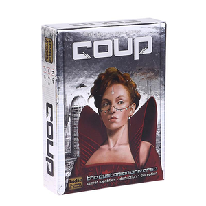

<br/>
<p align="center">
  <h3 align="center">The Resistance: Coup</h3>

  <p align="center">
    A simulated, agent-played version of the popular party game!
    <br/>
    <br/>
    <a href="https://github.com/dirkbrnd/resistance_coup/issues">Request Feature</a>
  </p>
</p>

    

## About The Project
<p align="center">
    
</p>


This is an automated version of [The Resistance: Coup](https://www.ultraboardgames.com/coup/game-rules.php#google_vignette) where OpenAI agents play the game for our entertainment.

The main package to mention here is [Autogen](https://microsoft.github.io/autogen/). It was instrumental in the multi-agent conversation setup!

You require an API key from [OpenAI](https://platform.openai.com/docs/overview) to be able to run this. 

## Getting Started

### Prerequisites

* This project is built on Python 3.11.
* The packages are maintained with [poetry](https://github.com/python-poetry/poetry).

### Steps to get playing

1. Clone the repo

```sh
git clone https://github.com/dirkbrnd/Resistance-Coup-Autogen.git
```

2. Install the game

```sh
poetry install
```

3. Create a `.env` file with your OpenAI key in the root directory.

```text
OPENAI_API_KEY=sk-xxxxxxxxxxxxxxxxxxxxxxxxxxx
```

4. Launch and watch the AI agents play the game!

```sh
python coup.py
```

## Roadmap

See the [open issues](https://github.com/dirkbrnd/Resistance-Coup-Autogen/issues) for a list of proposed features (and known issues).

## Contributing

Contributions are what make the open source community such an amazing place to be learn, inspire, and create. Any contributions you make are **greatly appreciated**.
* If you have suggestions for adding or removing projects, feel free to [open an issue](https://github.com/dirkbrnd/Resistance-Coup-Autogen/issues/new) to discuss it, or directly create a pull request.
* Please make sure you check your spelling and grammar.
* Create individual PR for each suggestion.

### Local setup for development
After you have cloned the repo:

1. Install the game

```sh
poetry install
```

2. Set up the pre-commit hooks

```sh
pre-commit install
```

3. Make your changes on a branch and create a PR!


### Creating A Pull Request

1. Clone the Project
2. Create your Feature Branch (`git checkout -b feature/AmazingFeature`)
3. Commit your Changes (`git commit -m 'Add some AmazingFeature'`)
4. Push to the Branch (`git push origin feature/AmazingFeature`)
5. Open a Pull Request

## License

Distributed under the MIT License. See [LICENSE](https://github.com/dirkbrnd/Resistance-Coup-Autogen/blob/main/LICENSE.md) for more information.

## Acknowledgements

* [Aaron Yuan](https://www.linkedin.com/in/aaron-yuan-776312a5/) for the inspiration!

